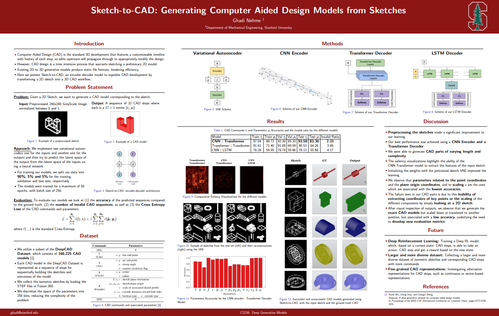

# Sketch-to-CAD-Generating-Computer-Aided-Design-Models-from-Sketches

This repository provides source code for our paper:

[Sketch-to-CAD: Generating Computer Aided Design Models from Sketches](https://arxiv.org/)

[Ghadi Nehme](https://github.com/ghadinehme)

<p align="center">
  
</p>

## Prerequisites

- Linux
- NVIDIA GPU + CUDA CuDNN
- Python 3.7, PyTorch 1.5+

## Dependencies

Install python package dependencies through pip:

```bash
$ pip install -r requirements.txt
```

Install [pythonocc](https://github.com/tpaviot/pythonocc-core) (OpenCASCADE) by conda:

```bash
$ conda install -c conda-forge pythonocc-core=7.5.1
```

## Data

You can access the data [here](https://drive.google.com/drive/folders/13FZ24h3AXATECRAXUoudqsSEQ5esILnE?usp=sharing).

## Models

You can access the models [here](https://drive.google.com/drive/folders/1x4HmgKC--KD4f2iBZZ7qV0CxxgQR9hF3?usp=sharing).
